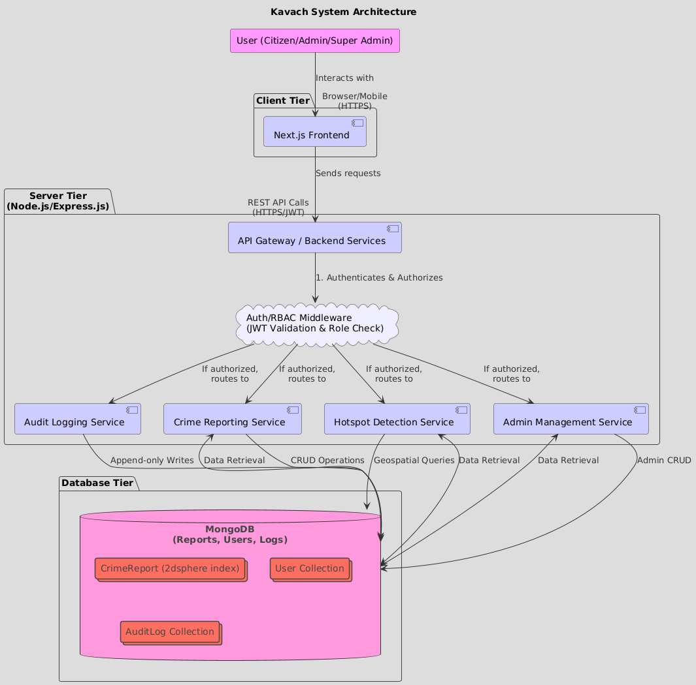
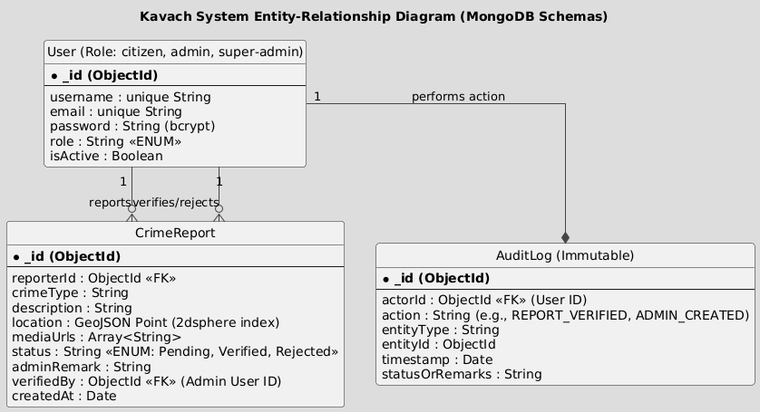

# System Design Document (SDD) – Crime Analytics and Hotspot Mapping System

## 1. Architecture Diagram

<!--  -->

## 2. ER Diagram

<!--  -->

## 3. Class Diagram
<!--  -->

## 4. Rest API Contracts

---

### 1. Authentication & User Management

| Endpoint | Method | Description | Auth Required | Allowed Roles |
| :--- | :--- | :--- | :--- | :--- |
| `/api/v1/auth/register` | `POST` | Register a new **Citizen** account. | No | Public |
| `/api/v1/auth/login` | `POST` | Login for all user roles (Citizen, Admin, Super Admin). | No | Public |
| `/api/v1/users/me` | `GET` | Fetch the current authenticated user's profile and role. | Yes | All Authenticated |

---

### 2. Crime Reporting & Tracking (Citizen Focus)

| Endpoint | Method | Description | Auth Required | Allowed Roles |
| :--- | :--- | :--- | :--- | :--- |
| `/api/v1/crime/report` | `POST` | Submit a new crime report (includes location and media upload). | Yes | **Citizen** |
| `/api/v1/crime/my-reports` | `GET` | View the citizen's submitted crime reports and their current status. | Yes | **Citizen** |
| `/api/v1/crime/public` | `GET` | Fetch all **verified** crime reports for public map display. | No | Public |

---

### 3. Verification & Management (Admin Focus)

| Endpoint | Method | Description | Auth Required | Allowed Roles |
| :--- | :--- | :--- | :--- | :--- |
| `/api/v1/admin/reports/pending` | `GET` | Retrieve a list of all unverified (`Pending`) crime reports. | Yes | **Admin** |
| `/api/v1/admin/reports/:id/verify` | `PATCH` | Update a report status to **Verified** or **Rejected** with a remark. **(Triggers Audit Log)** | Yes | **Admin** |
| `/api/v1/admin/reports/verified` | `GET` | Retrieve all verified crimes (used for Admin analytics dashboard). | Yes | **Admin** |
| `/api/v1/admin/analytics` | `GET` | Access aggregated crime trend data (e.g., counts by type, date range). | Yes | **Admin** |

---

### 4. Super Admin Management & Audit

| Endpoint | Method | Description | Auth Required | Allowed Roles |
| :--- | :--- | :--- | :--- | :--- |
| `/api/v1/admin/manage` | `GET` | Retrieve a list of all current Admin accounts. | Yes | **Super-Admin** |
| `/api/v1/admin/manage` | `POST` | Create a new Admin account. **(Triggers Audit Log)** | Yes | **Super-Admin** |
| `/api/v1/admin/manage/:id` | `PATCH` | Update or **deactivate** an existing Admin account. **(Triggers Audit Log)** | Yes | **Super-Admin** |
| `/api/v1/admin/manage/:id` | `DELETE` | Remove an Admin account (physical or soft delete). **(Triggers Audit Log)** | Yes | **Super-Admin** |
| `/api/v1/admin/logs` | `GET` | Retrieve and filter all system **Audit Logs** for accountability. | Yes | **Super-Admin** |

---

### 5. Geospatial & Hotspot Detection

| Endpoint | Method | Description | Auth Required | Allowed Roles |
| :--- | :--- | :--- | :--- | :--- |
| `/api/v1/geo/verified-crimes` | `GET` | Fetch detailed locations of verified crimes within a specified bounds (for map pins). | Yes | **Citizen**, **Admin** |
| `/api/v1/geo/hotspots` | `GET` | Execute the geospatial clustering query to find areas with $\ge 10$ verified crimes within a $\mathbf{1}$ km radius. **(Used for Heatmap)** | Yes | **Citizen**, **Admin** |

## 5. Wireframes

**wireframes** - [wire frames](assets/Kavach_UI_UX_Final.pdf)